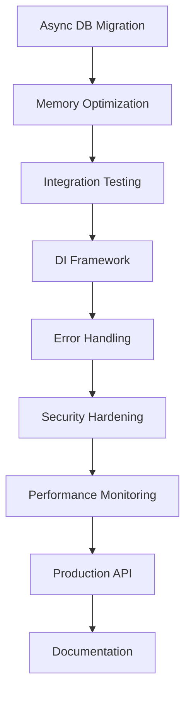

# OpenChronicle Development Master Plan

**Date**: August 5, 2025  
**Project**: OpenChronicle Core  
**Branch**: integration/core-modules-overhaul  
**Planning Horizon**: 6 months (August 2025 - February 2026)  
**Document Version**: 1.0  

---

# ⚠️ **CRITICAL DEVELOPMENT PHILOSOPHY** ⚠️

## **🚫 NO BACKWARDS COMPATIBILITY CONSTRAINTS 🚫**

**OpenChronicle is INTERNAL-ONLY development with NO PUBLIC API contracts.**

### **EMBRACE BREAKING CHANGES FOR BETTER ARCHITECTURE**

- ✅ **DO**: Replace inferior patterns with superior ones immediately
- ✅ **DO**: Redesign interfaces when we discover better approaches  
- ✅ **DO**: Deprecate and remove old code without transition periods
- ✅ **DO**: Optimize for future maintainability over current convenience

- ❌ **DON'T**: Keep old interfaces "for compatibility"
- ❌ **DON'T**: Add wrapper layers to preserve old calling patterns
- ❌ **DON'T**: Hesitate to make breaking changes when they improve the system
- ❌ **DON'T**: Maintain deprecated code paths "just in case"

### **IMPLEMENTATION STRATEGY**
When we design a better method:
1. **Implement the new approach completely**
2. **Remove the old approach entirely** 
3. **Update all calling code** 
4. **Delete deprecated patterns**
5. **Move forward without looking back**

**This is not public software - we control the entire codebase. Use that advantage!**

---

## Executive Summary

Based on comprehensive analysis of the CODE_REVIEW_REPORT.md, PROJECT_WORKFLOW_OVERVIEW.md, and NEXT_STEPS_20050805.md, this master plan consolidates findings into a strategic roadmap for hardening, optimizing, and expanding the OpenChronicle narrative AI engine.

### **Current State Assessment**
- ✅ **Strong Foundation**: Excellent orchestrator architecture with 13+ specialized systems
- ✅ **Modern Infrastructure**: 76 tests (100% pass rate), comprehensive performance monitoring
- ✅ **Production Ready**: 15+ LLM providers, robust fallback chains, proper error handling
- ⚠️ **Optimization Needed**: Performance bottlenecks, testing gaps, configuration complexity

### **Strategic Objectives**
1. **Phase 1 (Weeks 1-4)**: Foundation Hardening & Critical Performance
2. **Phase 2 (Weeks 5-12)**: Architecture Enhancement & Testing Expansion  
3. **Phase 3 (Weeks 13-20)**: Advanced Features & Production Optimization
4. **Phase 4 (Weeks 21-26)**: Ecosystem Expansion & Long-term Sustainability

---

## Phase 1: Foundation Hardening & Critical Performance (4 weeks)

### **Week 1: Critical Performance & Database Operations**

#### 🔥 **Critical Priority Tasks**

**1. Async Database Operations Migration**
- **Objective**: Convert all blocking database calls to async/await pattern
- **Impact**: Significant performance improvement, better responsiveness
- **Files**: `core/database_systems/`, memory management, scene logging
- **Implementation**:
  ```python
  # Convert synchronous operations
  async def safe_database_operation(self, operation_func, *args, **kwargs):
      async with aiosqlite.connect(self.db_path) as conn:
          async with conn.begin():
              return await operation_func(conn, *args, **kwargs)
  ```
- **Testing**: Add async operation tests, verify no blocking calls remain
- **Timeline**: 3-4 days

**2. Memory Performance Optimization**
- **Objective**: Implement lazy loading and LRU caching for large datasets
- **Impact**: Better scalability for large stories, reduced memory pressure
- **Implementation**:
  ```python
  from functools import lru_cache
  from cachetools import TTLCache
  
  class MemoryOrchestrator:
      @lru_cache(maxsize=256)
      def get_character_memory(self, character_id):
          return self._load_character_memory(character_id)
  ```
- **Testing**: Memory usage benchmarks, large dataset stress tests
- **Timeline**: 2-3 days

**3. Registry Schema Validation (from NEXT_STEPS)**
- **Objective**: Add pydantic validation for model_registry.json integrity
- **Impact**: Prevent configuration corruption, better error messages
- **Implementation**:
  ```python
  from pydantic import BaseModel, validator
  
  class ModelRegistrySchema(BaseModel):
      metadata: Dict[str, Any]
      defaults: Dict[str, str]
      text_models: Dict[str, List[ModelConfig]]
      
      @validator('text_models')
      def validate_unique_names(cls, v):
          # Ensure unique model names
          pass
  ```
- **Timeline**: 1-2 days

### **Week 2: Logging System & Configuration Hardening**

**1. Log Rotation & Context Enhancement**
- **Objective**: Implement rotating file handlers and context tags
- **Impact**: Better log management, improved debugging capability
- **Implementation**:
  ```python
  import logging.handlers
  
  class ContextualLogger:
      def __init__(self):
          handler = logging.handlers.RotatingFileHandler(
              'logs/system.log', maxBytes=10*1024*1024, backupCount=5
          )
          formatter = logging.Formatter(
              '%(asctime)s - %(name)s - %(levelname)s - '
              '[story:%(story_id)s] [scene:%(scene_id)s] - %(message)s'
          )
  ```
- **Timeline**: 2 days

**2. Configuration Management Centralization**
- **Objective**: Centralize scattered configuration with typed classes
- **Impact**: Easier configuration management, reduced magic numbers
- **Implementation**:
  ```python
  @dataclass
  class SystemConfig:
      performance: PerformanceConfig
      model: ModelConfig
      database: DatabaseConfig
      security: SecurityConfig
  ```
- **Timeline**: 2-3 days

**3. Auto Backup on Registry Save**
- **Objective**: Create .bak files before registry modifications
- **Impact**: Prevent accidental configuration loss
- **Timeline**: 1 day

### **Week 3: Integration Testing Foundation**

**1. Integration Test Suite Creation**
- **Objective**: Add comprehensive end-to-end workflow testing
- **Impact**: Catch integration issues, improve reliability
- **Implementation**:
  ```python
  @pytest.mark.integration
  async def test_complete_scene_generation_workflow():
      # Test full pipeline: input → analysis → context → generation → memory
      user_input = "The hero enters the dark forest"
      result = await orchestrator.generate_scene(user_input)
      
      assert result.scene_id is not None
      assert result.content is not None
      assert result.memory_updates is not None
  ```
- **Timeline**: 3-4 days

**2. Mock Adapter System Enhancement**
- **Objective**: Create comprehensive mock LLMs for reliable testing
- **Impact**: Isolated testing, faster test execution
- **Timeline**: 1-2 days

### **Week 4: Startup Health & Database Integrity**

**1. Database Integrity Checks**
- **Objective**: Run PRAGMA integrity_check on startup
- **Impact**: Early detection of database corruption
- **Implementation**:
  ```python
  async def startup_health_check():
      for db_path in self.get_all_databases():
          async with aiosqlite.connect(db_path) as conn:
              result = await conn.execute("PRAGMA integrity_check")
              if result != "ok":
                  log_error(f"Database corruption detected: {db_path}")
  ```
- **Timeline**: 1-2 days

**2. Performance Regression Testing Setup**
- **Objective**: Add pytest-benchmark for performance validation
- **Impact**: Prevent performance regressions
- **Timeline**: 2 days

**3. Phase 1 Consolidation & Documentation**
- **Objective**: Update documentation, validate all changes
- **Timeline**: 1 day

---

## Phase 2: Architecture Enhancement & Testing Expansion (8 weeks)

### **Weeks 5-6: Dependency Injection Framework**

**1. Lightweight DI Container Implementation**
- **Objective**: Replace manual dependency wiring with DI container
- **Impact**: Better testability, reduced coupling
- **Implementation**:
  ```python
  class DIContainer:
      def __init__(self):
          self._services = {}
          self._singletons = {}
      
      def register(self, interface, implementation, singleton=False):
          self._services[interface] = (implementation, singleton)
      
      def resolve(self, interface):
          implementation, singleton = self._services[interface]
          if singleton:
              if interface not in self._singletons:
                  self._singletons[interface] = implementation()
              return self._singletons[interface]
          return implementation()
  ```
- **Migration Strategy**: Complete replacement - remove all manual dependency wiring
- **Timeline**: 2 weeks

### **Weeks 7-8: Error Handling Standardization**

**1. Standardized Error Handling Framework**
- **Objective**: Create consistent error handling patterns
- **Impact**: Consistent error behavior, easier maintenance
- **Implementation**:
  ```python
  def handle_errors(exception_types=None, fallback_result=None):
      def decorator(func):
          @wraps(func)
          async def wrapper(*args, **kwargs):
              try:
                  return await func(*args, **kwargs)
              except Exception as e:
                  log_error(f"Error in {func.__name__}: {e}")
                  return fallback_result
          return wrapper
      return decorator
  ```
- **Timeline**: 2 weeks

### **Weeks 9-10: Security Hardening**

**1. Input Validation & Sanitization**
- **Objective**: Implement comprehensive input validation
- **Impact**: Enhanced security posture
- **Implementation**:
  ```python
  class SecurityValidator:
      def validate_user_input(self, content: str) -> ValidationResult:
          # Content sanitization, length validation, safety checks
          pass
      
      def validate_file_path(self, path: str) -> bool:
          # Path traversal prevention
          pass
  ```
- **Timeline**: 1.5 weeks

**2. Database Security Audit**
- **Objective**: Audit for SQL injection vulnerabilities
- **Timeline**: 0.5 weeks

### **Weeks 11-12: Interface Segregation & Architecture Cleanup**

**1. Interface Segregation Implementation**
- **Objective**: Split large interfaces into focused ones
- **Impact**: Better SOLID principle adherence
- **Example**: Split ModelOrchestrator into ModelConfigManager and ModelExecutor
- **Timeline**: 2 weeks

---

## Phase 3: Advanced Features & Production Optimization (8 weeks)

### **Weeks 13-15: Advanced Testing Infrastructure**

**1. Concurrency Testing Suite**
- **Objective**: Test multi-threaded and async operations
- **Implementation**:
  ```python
  @pytest.mark.asyncio
  async def test_concurrent_scene_generation():
      tasks = [asyncio.create_task(generate_scene(f"Scene {i}")) 
               for i in range(10)]
      results = await asyncio.gather(*tasks)
      assert len(results) == 10
      assert all(r.scene_id for r in results)
  ```
- **Timeline**: 2 weeks

**2. End-to-End User Session Testing**
- **Objective**: Simulate complete user interactions
- **Timeline**: 1 week

### **Weeks 16-17: Performance Optimization Advanced**

**1. Advanced Caching Strategies**
- **Objective**: Implement sophisticated caching layers
- **Implementation**: Redis integration, distributed caching
- **Timeline**: 2 weeks

### **Weeks 18-20: Production Features**

**1. Real-time Performance Monitoring Dashboard**
- **Objective**: Create visual performance monitoring
- **Implementation**: Web dashboard with metrics visualization
- **Timeline**: 2 weeks

**2. Advanced Model Selection Algorithms**
- **Objective**: Implement intelligent model routing based on performance
- **Timeline**: 1 week

---

## Phase 4: Ecosystem Expansion & Long-term Sustainability (6 weeks)

### **Weeks 21-23: API & Integration Layer**

**1. RESTful API Enhancement**
- **Objective**: Production-ready API with authentication
- **Implementation**: FastAPI with JWT, rate limiting, OpenAPI docs
- **Timeline**: 2 weeks

**2. Plugin Architecture**
- **Objective**: Enable third-party extensions
- **Timeline**: 1 week

### **Weeks 24-26: Documentation & Deployment**

**1. Comprehensive Documentation Suite**
- **Objective**: Complete developer and user documentation
- **Components**: API docs, architecture guides, tutorials
- **Timeline**: 2 weeks

**2. Production Deployment Pipeline**
- **Objective**: Docker, CI/CD, monitoring setup
- **Timeline**: 1 week

---

## Implementation Strategy & Risk Management

### **Parallel Development Tracks**

**Track A: Core Infrastructure** (Weeks 1-12)
- Database optimization, configuration management, testing

**Track B: Architecture Enhancement** (Weeks 5-16)  
- DI framework, error handling, security hardening

**Track C: Advanced Features** (Weeks 13-26)
- Performance monitoring, API enhancement, documentation

### **Risk Mitigation Strategies**

#### **High Risk Areas**
1. **Async Database Migration**
   - **Risk**: Breaking existing functionality during transition
   - **Mitigation**: Comprehensive testing of new async patterns
   - **Approach**: Complete replacement - no fallback to sync patterns

2. **DI Framework Implementation**
   - **Risk**: Initial complexity increase
   - **Mitigation**: Thorough design phase, start with core components
   - **Approach**: Full implementation - remove manual dependency wiring

3. **Security Changes**
   - **Risk**: Disrupting existing workflows
   - **Mitigation**: Extensive testing, security scanning
   - **Approach**: Secure by default - update all code paths immediately

#### **Medium Risk Areas**
1. **Interface Redesign**
   - **Risk**: Coordinating changes across modules
   - **Mitigation**: Module-by-module replacement, comprehensive testing

2. **Performance Optimizations**
   - **Risk**: Introducing new bugs
   - **Mitigation**: Benchmark-driven development, thorough testing

### **Quality Gates & Success Metrics**

#### **Phase 1 Success Criteria**
- [ ] All database operations async (0 blocking calls)
- [ ] Memory usage < 500MB for typical workloads
- [ ] Test coverage > 80% on core modules
- [ ] Startup health checks pass 100%
- [ ] Log rotation functional with context tags

#### **Phase 2 Success Criteria**
- [ ] DI container operational for new components
- [ ] Standardized error handling across all modules
- [ ] Security validation passes penetration testing
- [ ] Interface segregation complete for 3+ orchestrators

#### **Phase 3 Success Criteria**
- [ ] Concurrency tests pass under load
- [ ] Performance dashboard operational
- [ ] Advanced caching reduces response time by 30%
- [ ] E2E test suite covers all user workflows

#### **Phase 4 Success Criteria**
- [ ] Production API with <100ms response time
- [ ] Plugin architecture supports 3rd party extensions
- [ ] Complete documentation suite
- [ ] Automated deployment pipeline operational

---

## Resource Allocation & Timeline

### **Development Effort Distribution**

| Phase | Duration | Focus Areas | Risk Level | Resource Intensity |
|-------|----------|-------------|------------|-------------------|
| 1 | 4 weeks | Performance, Testing | High | Very High |
| 2 | 8 weeks | Architecture, Security | Medium | High |
| 3 | 8 weeks | Advanced Features | Medium | Medium |
| 4 | 6 weeks | Production, Docs | Low | Medium |

### **Critical Path Dependencies**



### **Parallel Work Streams**

- **Stream 1**: Core performance (Weeks 1-4)
- **Stream 2**: Testing infrastructure (Weeks 3-8)  
- **Stream 3**: Architecture enhancement (Weeks 5-12)
- **Stream 4**: Advanced features (Weeks 13-20)
- **Stream 5**: Production readiness (Weeks 21-26)

---

## Technology Stack Evolution

### **New Dependencies to Add**

#### **Phase 1**
- `aiosqlite` - Async database operations
- `pydantic` - Configuration validation
- `pytest-benchmark` - Performance testing

#### **Phase 2**  
- `dependency-injector` - DI framework
- `bandit` - Security scanning
- `structlog` - Structured logging

#### **Phase 3**
- `redis` - Advanced caching
- `prometheus_client` - Metrics collection
- `fastapi[all]` - Production API

#### **Phase 4**
- `sphinx` - Documentation generation
- `docker-compose` - Container orchestration
- `pytest-xdist` - Parallel testing

### **Infrastructure Evolution**

#### **Current State**
- SQLite databases
- File-based configuration
- Basic logging
- Manual deployment

#### **Target State**
- Async SQLite with Redis caching
- Validated configuration with hot-reload
- Structured logging with rotation
- Containerized deployment with CI/CD

---

## Monitoring & Success Tracking

### **Key Performance Indicators (KPIs)**

#### **Technical Metrics**
- **Response Time**: Scene generation < 2 seconds
- **Memory Usage**: < 500MB typical workload
- **Test Coverage**: > 85% core modules
- **Bug Rate**: < 1 bug per 1000 lines
- **Security Vulnerabilities**: Zero high-severity

#### **Development Metrics**
- **Build Time**: CI/CD pipeline < 5 minutes
- **Test Execution**: Full suite < 60 seconds
- **Code Review Time**: < 24 hours average
- **Documentation Coverage**: 100% public APIs

#### **User Experience Metrics**
- **System Availability**: 99.9% uptime
- **Model Selection Accuracy**: > 95%
- **Error Recovery**: 100% graceful degradation
- **Startup Time**: < 10 seconds

### **Weekly Progress Reviews**

#### **Review Structure**
1. **Completed Tasks**: What was delivered
2. **Performance Metrics**: KPI measurements
3. **Risk Assessment**: Issues identified
4. **Next Week Planning**: Priorities adjustment
5. **Resource Needs**: Blockers and dependencies

#### **Monthly Milestone Reviews**
1. **Phase Completion Assessment**
2. **Architecture Review**
3. **Performance Benchmarking**
4. **Security Audit**
5. **Documentation Update**

---

## Contingency Planning

### **Scenario A: Performance Issues Persist**
- **Trigger**: Database operations still slow after async migration
- **Response**: Implement connection pooling, consider PostgreSQL migration
- **Timeline Impact**: +2 weeks to Phase 1

### **Scenario B: DI Framework Complexity**
- **Trigger**: DI implementation causes performance degradation
- **Response**: Simplify to manual injection with interface contracts
- **Timeline Impact**: -1 week from Phase 2

### **Scenario C: Security Vulnerabilities Found**
- **Trigger**: Penetration testing reveals critical issues
- **Response**: Emergency security sprint, delay feature development
- **Timeline Impact**: +3 weeks overall

### **Scenario D: Resource Constraints**
- **Trigger**: Limited development time availability
- **Response**: Prioritize critical path items, defer advanced features
- **Timeline Impact**: Extend to 8 months total

---

## Long-term Vision (6+ months)

### **Year 1 Goals**
- Enterprise-ready narrative AI platform
- Multi-tenant architecture
- Advanced analytics and insights
- Plugin ecosystem with marketplace

### **Year 2 Goals**  
- Cloud-native deployment
- Real-time collaboration features
- Advanced AI model integration (GPT-5, Claude-4)
- Mobile and web applications

### **Technology Evolution Path**
- **Current**: Single-user desktop application
- **6 months**: Production-ready server with API
- **12 months**: Multi-tenant cloud platform
- **24 months**: Distributed, scalable ecosystem

---

## Conclusion

This master plan provides a structured approach to evolving OpenChronicle from its current strong foundation into a production-ready, scalable narrative AI platform. The phased approach balances immediate performance needs with long-term architectural goals while maintaining system stability throughout the transformation.

### **Key Success Factors**
1. **Disciplined Execution**: Follow phase gates and quality criteria
2. **Risk Management**: Proactive identification and mitigation
3. **Performance Focus**: Continuous monitoring and optimization
4. **User-Centric Design**: Maintain focus on developer and end-user experience
5. **Documentation Culture**: Keep documentation current throughout development

The plan is designed to be adaptable, allowing for priority adjustments based on emerging needs while maintaining the core trajectory toward a robust, production-ready system.

---

**Master Plan Version**: 1.0  
**Next Review**: August 12, 2025 (1 week)  
**Plan Owner**: Development Team Lead  
**Stakeholder Review**: Monthly milestone meetings
