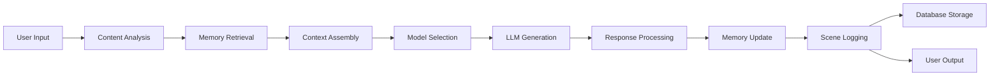
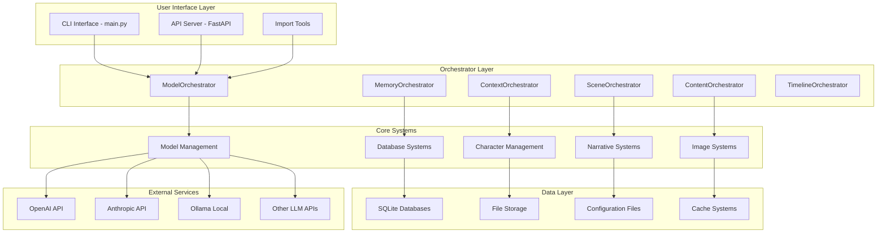
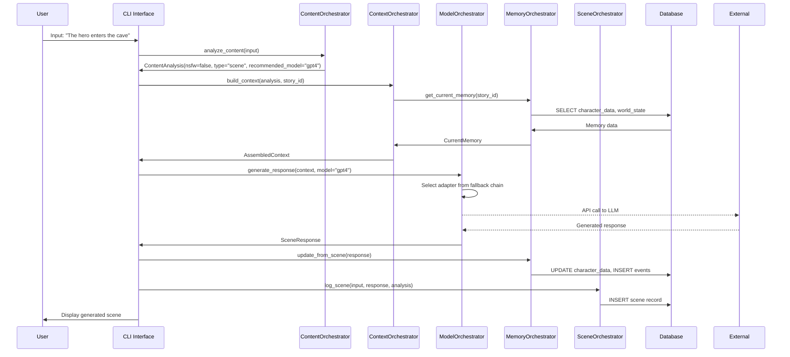
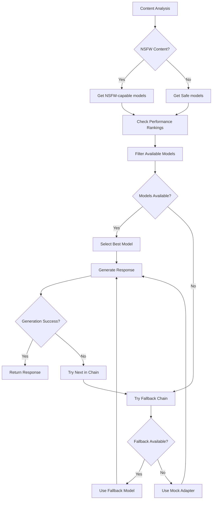
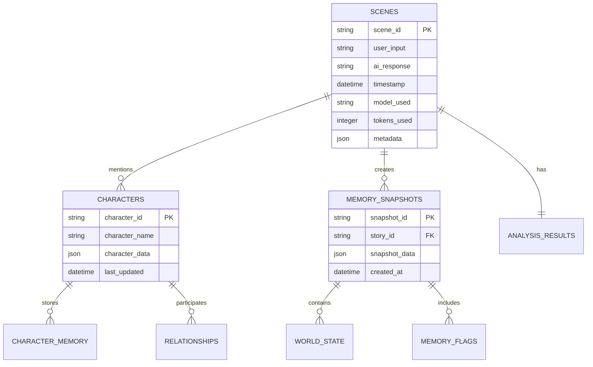
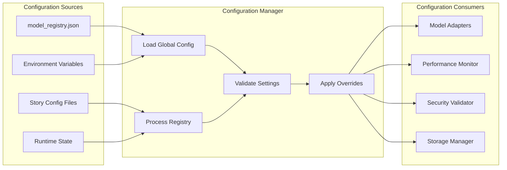

# OpenChronicle Project Workflow Overview

**Date**: August 6, 2025  
**Project**: OpenChronicle Core  
**Branch**: main  
**Target Audience**: Developer Review & Onboarding  
**Document Version**: 2.0  
**Status**: Post-Cleanup Production Ready  

---

## Table of Contents

1. [Setup Instructions](#1-setup-instructions)
2. [Main Execution Flow](#2-main-execution-flow)
3. [Model Interaction](#3-model-interaction)
4. [Data Flow](#4-data-flow)
5. [Automation & Scripts](#5-automation--scripts)
6. [Error Handling & Edge Cases](#6-error-handling--edge-cases)
7. [System Architecture Diagrams](#7-system-architecture-diagrams)
8. [Development Workflow](#8-development-workflow)
9. [Troubleshooting Guide](#9-troubleshooting-guide)

---

## 1. Setup Instructions

### 1.1 Prerequisites

```bash
# Required Software
- Python 3.10+ (3.11+ recommended)
- Git
- pip or conda package manager

# Optional but Recommended
- Docker (for containerized deployment)
- VS Code with Python extension
- SQLite Browser (for database inspection)
```

### 1.2 Initial Installation

```bash
# 1. Clone the repository
git clone https://github.com/OpenChronicle/openchronicle-core.git
cd openchronicle-core

# 2. Create virtual environment
python -m venv openchronicle-env
source openchronicle-env/bin/activate  # Linux/Mac
# OR
openchronicle-env\Scripts\activate     # Windows

# 3. Install dependencies
pip install -r requirements.txt

# 4. Verify installation
python -c "from core.model_management import ModelOrchestrator; print('Installation successful')"
```

### 1.3 Environment Variables

Create a `.env` file in the project root:

```bash
# AI Model API Keys (Optional - system works with mock adapters)
OPENAI_API_KEY=your_openai_key_here
ANTHROPIC_API_KEY=your_anthropic_key_here
GOOGLE_API_KEY=your_google_key_here
GROQ_API_KEY=your_groq_key_here
COHERE_API_KEY=your_cohere_key_here
MISTRAL_API_KEY=your_mistral_key_here

# Ollama Configuration (if using local models)
OLLAMA_BASE_URL=http://localhost:11434

# System Configuration
LOG_LEVEL=INFO
ENABLE_PERFORMANCE_MONITORING=true
```

### 1.4 Configuration Files

Key configuration files to verify:

```bash
config/
├── model_registry.json          # Central model configuration
├── registry_settings.json       # Global registry settings
└── models/                      # Individual provider configs
    ├── openai.json
    ├── anthropic.json
    ├── ollama.json
    └── ...
```

### 1.5 Initial System Test

```bash
# Run the test suite to verify everything works
python -m pytest tests/ -v

# Run the main application
python main.py --help

# Test model initialization
python -c "
from core.model_management import ModelOrchestrator
orchestrator = ModelOrchestrator()
print(f'Available adapters: {len(orchestrator.adapters)}')
"
```

---

## 2. Main Execution Flow

### 2.1 Application Entry Points

#### Primary Entry Point: `main.py`
```python
# Main CLI application - handles user interactions
python main.py [options]

# Key functions:
- load_imports()           # Lazy loading of heavy modules
- show_model_info()        # Display available models
- interactive_mode()       # Main user interaction loop
- scene_generation()       # Core scene generation workflow
```

#### Secondary Entry Points:
- **API Server**: `utilities/api_server.py` (FastAPI-based)
- **Import Tools**: `utilities/storypack_importer.py`
- **Testing**: `pytest tests/`

### 2.2 System Initialization Flow

```mermaid
graph TD
    A[main.py] --> B[load_imports()]
    B --> C[Create Orchestrators]
    C --> D[ModelOrchestrator]
    C --> E[MemoryOrchestrator]
    C --> F[ContextOrchestrator]
    C --> G[SceneOrchestrator]
    
    D --> H[ConfigurationManager]
    D --> I[LifecycleManager]
    D --> J[PerformanceMonitor]
    D --> K[ResponseGenerator]
    
    H --> L[Load model_registry.json]
    I --> M[Initialize Available Adapters]
    M --> N[Validate API Keys]
    M --> O[Test Connectivity]
```

### 2.3 User Interaction Flow

```python
# Typical user session flow:
1. Application Start → main.py
2. Lazy Import → Heavy modules loaded on-demand
3. Orchestrator Creation → All systems initialized
4. User Input → CLI or API interface
5. Content Analysis → Classify and route input
6. Context Building → Assemble relevant context
7. Model Selection → Choose appropriate LLM
8. Scene Generation → Generate response
9. Memory Update → Store results and update state
10. Output Display → Present results to user
```

### 2.4 Key Orchestrator Interactions

```python
# Scene Generation Workflow
async def generate_scene(user_input: str):
    # 1. Content Analysis
    analysis = await content_orchestrator.analyze_content(user_input)
    
    # 2. Context Assembly
    context = await context_orchestrator.build_context(
        analysis, story_id, current_memory
    )
    
    # 3. Model Selection & Generation
    response = await model_orchestrator.generate_response(
        context.prompt, adapter_name=analysis.recommended_model
    )
    
    # 4. Memory Update
    await memory_orchestrator.update_from_scene(response)
    
    # 5. Scene Logging
    scene_id = await scene_orchestrator.log_scene(
        user_input, response, analysis
    )
    
    return SceneResult(scene_id, response, analysis)
```

---

## 3. Model Interaction

### 3.1 Model Registry System

#### Registry Structure
```json
{
  "metadata": {
    "name": "OpenChronicle Model Registry",
    "version": "2.0.0"
  },
  "defaults": {
    "text_model": "openai_gpt4",
    "image_model": "openai_dalle"
  },
  "text_models": {
    "production": [
      {
        "name": "openai_gpt4",
        "provider": "openai",
        "enabled": true,
        "model_name": "gpt-4",
        "supports_nsfw": false
      }
    ]
  },
  "fallback_chains": {
    "openai_gpt4": ["anthropic_claude", "groq_llama", "mock"]
  }
}
```

### 3.2 Adapter Initialization Process

```python
# Adapter lifecycle managed by LifecycleManager
class LifecycleManager:
    async def initialize_adapter(self, name: str):
        # 1. Validate Prerequisites
        validation = self._validate_adapter_prerequisites(name)
        if not validation["valid"]:
            return False
            
        # 2. Create Adapter Instance
        adapter = self._create_adapter_instance(adapter_type, config)
        
        # 3. Initialize with Timeout Protection
        success = await asyncio.wait_for(
            adapter.initialize(), timeout=30.0
        )
        
        # 4. Register Active Adapter
        if success:
            self.adapters[name] = adapter
            
        return success
```

### 3.3 Model Selection Strategy

```python
# Intelligent model routing via ContentAnalysisOrchestrator
class ModelSelectionFlow:
    def select_model(self, content_analysis):
        # 1. Content-based routing
        if content_analysis.nsfw_detected:
            candidates = registry.get_nsfw_capable_models()
        else:
            candidates = registry.get_safe_models()
            
        # 2. Performance-based selection
        performance_rankings = performance_monitor.get_model_rankings()
        
        # 3. Availability check
        available_models = [m for m in candidates if m in active_adapters]
        
        # 4. Fallback chain application
        selected = available_models[0] if available_models else fallback_chain[0]
        
        return selected
```

### 3.4 Supported Model Providers

| Provider | Adapter Class | Models Supported | Status |
|----------|---------------|------------------|---------|
| OpenAI | `OpenAIAdapter` | GPT-4, GPT-3.5, DALL-E | ✅ Production |
| Anthropic | `AnthropicAdapter` | Claude-3, Claude-2 | ✅ Production |
| Google | `GeminiAdapter` | Gemini Pro, Gemini Vision | ✅ Production |
| Groq | `GroqAdapter` | Llama-3, Mixtral | ✅ Production |
| Cohere | `CohereAdapter` | Command, Command-R | ✅ Production |
| Mistral | `MistralAdapter` | Mistral Large/Medium | ✅ Production |
| Ollama | `OllamaAdapter` | All Ollama models | ✅ Production |
| Mock | `MockAdapter` | Testing/Development | ✅ Always Available |

---

## 4. Data Flow

### 4.1 High-Level Data Architecture



### 4.2 Database Schema & Storage

#### SQLite Database Structure
```sql
-- Primary database: storage/stories/{story_id}/story.db

-- Scene logging
CREATE TABLE scenes (
    scene_id TEXT PRIMARY KEY,
    user_input TEXT,
    ai_response TEXT,
    timestamp DATETIME,
    model_used TEXT,
    tokens_used INTEGER,
    metadata JSON
);

-- Character data
CREATE TABLE characters (
    character_id TEXT PRIMARY KEY,
    character_name TEXT,
    character_data JSON,
    last_updated DATETIME
);

-- Memory snapshots
CREATE TABLE memory_snapshots (
    snapshot_id TEXT PRIMARY KEY,
    story_id TEXT,
    snapshot_data JSON,
    created_at DATETIME
);
```

#### File System Structure
```
storage/
├── stories/
│   └── {story_id}/
│       ├── story.db              # Main story database
│       ├── config.json           # Story-specific config
│       ├── memory/
│       │   ├── character_memory.json
│       │   ├── world_state.json
│       │   └── memory_flags.json
│       └── images/               # Generated images
│           ├── characters/
│           └── scenes/
└── global/
    ├── model_runtime_state.json  # Model performance data
    └── system_logs/
```

### 4.3 Memory Management Flow

```python
# Memory system data flow
class MemoryDataFlow:
    async def update_from_scene(self, scene_result):
        # 1. Extract entities and events
        entities = self.extract_entities(scene_result.content)
        events = self.extract_events(scene_result.content)
        
        # 2. Update character memories
        for character in entities.characters:
            await self.update_character_memory(character, scene_result)
            
        # 3. Update world state
        await self.update_world_state(events, scene_result)
        
        # 4. Create memory snapshot
        snapshot_id = await self.create_snapshot(scene_result.scene_id)
        
        # 5. Persist to database
        await self.persist_memory_changes()
```

### 4.4 Caching Strategy

```python
# Multi-level caching system
class CachingLayers:
    # 1. In-Memory Caching (LRU)
    @lru_cache(maxsize=256)
    def get_character_data(self, character_id):
        return self._load_character_from_db(character_id)
    
    # 2. Database Connection Pooling
    connection_pool = aiosqlite.connect(database_url, pool_size=10)
    
    # 3. Model Response Caching (for development)
    response_cache = TTLCache(maxsize=100, ttl=3600)  # 1 hour TTL
    
    # 4. Configuration Caching
    config_cache = {}  # Invalidated on file changes
```

### 4.5 Performance Monitoring Data

```python
# Performance data collection and storage
class PerformanceDataFlow:
    def track_operation(self, operation_type, duration, metadata):
        # 1. Real-time metrics
        self.current_metrics[operation_type].append({
            'duration': duration,
            'timestamp': datetime.now(),
            'metadata': metadata
        })
        
        # 2. Aggregate statistics
        self.update_rolling_averages(operation_type, duration)
        
        # 3. Bottleneck detection
        if duration > self.thresholds[operation_type]:
            self.flag_potential_bottleneck(operation_type, metadata)
            
        # 4. Persist to runtime state
        self.save_performance_data()
```

---

## 5. Automation & Scripts

### 5.1 Available Scripts

#### Setup & Development Scripts
```bash
# Development setup
./scripts/setup_dev.sh              # Development environment setup
./scripts/install_dependencies.sh   # Install all dependencies
./scripts/setup_git_hooks.sh        # Pre-commit hooks setup

# Testing scripts
./scripts/run_tests.sh               # Full test suite
./scripts/run_integration_tests.sh  # Integration tests only
./scripts/run_performance_tests.sh  # Performance benchmarks
```

#### VS Code Tasks (tasks.json)
```json
{
  "tasks": [
    {
      "label": "Run Main",
      "type": "shell", 
      "command": "python",
      "args": ["main.py"],
      "group": "build"
    },
    {
      "label": "Run Tests",
      "type": "shell",
      "command": "python", 
      "args": ["-m", "pytest", "tests/", "-v"],
      "group": "test"
    },
    {
      "label": "Install Dependencies",
      "type": "shell",
      "command": "pip",
      "args": ["install", "-r", "requirements.txt"],
      "group": "build"
    }
  ]
}
```

### 5.2 Docker Configuration

#### Dockerfile
```dockerfile
FROM python:3.11-slim

WORKDIR /app

# Install system dependencies
RUN apt-get update && apt-get install -y \
    build-essential \
    && rm -rf /var/lib/apt/lists/*

# Install Python dependencies
COPY requirements.txt .
RUN pip install --no-cache-dir -r requirements.txt

# Copy application code
COPY . .

# Create storage directories
RUN mkdir -p storage/stories storage/global

# Expose port for API server
EXPOSE 8000

# Default command
CMD ["python", "main.py"]
```

#### Docker Compose
```yaml
version: '3.8'
services:
  openchronicle:
    build: .
    ports:
      - "8000:8000"
    environment:
      - LOG_LEVEL=INFO
    volumes:
      - ./storage:/app/storage
      - ./config:/app/config
    depends_on:
      - ollama
      
  ollama:
    image: ollama/ollama:latest
    ports:
      - "11434:11434"
    volumes:
      - ollama_data:/root/.ollama
      
volumes:
  ollama_data:
```

### 5.3 Automated Testing Pipeline

#### GitHub Actions Workflow
```yaml
name: CI/CD Pipeline

on: [push, pull_request]

jobs:
  test:
    runs-on: ubuntu-latest
    strategy:
      matrix:
        python-version: [3.10, 3.11, 3.12]
        
    steps:
    - uses: actions/checkout@v3
    
    - name: Set up Python
      uses: actions/setup-python@v4
      with:
        python-version: ${{ matrix.python-version }}
        
    - name: Install dependencies
      run: |
        pip install -r requirements.txt
        pip install pytest-cov
        
    - name: Run tests
      run: |
        pytest tests/ --cov=core --cov-report=xml
        
    - name: Upload coverage
      uses: codecov/codecov-action@v3
```

### 5.4 Model Discovery & Registration

#### Automatic Ollama Model Discovery
```python
# Automated model discovery script
async def discover_and_register_models():
    """Automatically discover and register available models"""
    
    # 1. Discover Ollama models
    ollama_models = await model_orchestrator.discover_ollama_models()
    
    # 2. Auto-register discovered models
    for model_info in ollama_models:
        await model_orchestrator.add_discovered_ollama_models(
            auto_enable=True
        )
    
    # 3. Update registry
    model_orchestrator.save_model_registry()
    
    # 4. Log discovery results
    log_system_event("model_discovery", f"Discovered {len(ollama_models)} models")
```

---

## 6. Error Handling & Edge Cases

### 6.1 Model Availability Handling

#### Graceful Degradation Strategy
```python
# Model failure handling with fallback chains
class ModelFailureHandling:
    async def generate_with_fallback(self, prompt, preferred_model):
        fallback_chain = self.get_fallback_chain(preferred_model)
        
        for model_name in fallback_chain:
            try:
                if model_name in self.active_adapters:
                    response = await self.adapters[model_name].generate(prompt)
                    log_info(f"Successfully used {model_name}")
                    return response
                else:
                    log_warning(f"Model {model_name} not available, trying next in chain")
                    
            except Exception as e:
                log_error(f"Model {model_name} failed: {e}")
                continue
                
        # Final fallback to mock adapter
        log_warning("All models failed, using mock adapter")
        return await self.mock_adapter.generate(prompt)
```

### 6.2 Network & Connectivity Issues

#### Retry Logic with Exponential Backoff
```python
# Network error handling
class NetworkErrorHandling:
    async def initialize_adapter_with_retry(self, name, max_retries=3):
        for attempt in range(max_retries + 1):
            try:
                return await self._initialize_adapter(name)
                
            except (ConnectionError, TimeoutError) as e:
                if attempt < max_retries:
                    wait_time = 2 ** attempt  # Exponential backoff
                    log_warning(f"Retrying {name} in {wait_time}s (attempt {attempt + 1})")
                    await asyncio.sleep(wait_time)
                else:
                    log_error(f"Failed to initialize {name} after {max_retries} attempts")
                    return False
```

### 6.3 Input Validation & Sanitization

#### Content Safety & Validation
```python
# Input validation pipeline
class InputValidation:
    def validate_user_input(self, content: str) -> Dict[str, Any]:
        validation_result = {
            'valid': True,
            'warnings': [],
            'errors': [],
            'sanitized_content': content
        }
        
        # 1. Length validation
        if len(content) > self.MAX_INPUT_LENGTH:
            validation_result['errors'].append("Input too long")
            validation_result['valid'] = False
            
        # 2. Content safety check
        if self._contains_unsafe_content(content):
            validation_result['warnings'].append("Potentially unsafe content detected")
            validation_result['sanitized_content'] = self._sanitize_content(content)
            
        # 3. Encoding validation
        try:
            content.encode('utf-8')
        except UnicodeEncodeError:
            validation_result['errors'].append("Invalid character encoding")
            validation_result['valid'] = False
            
        return validation_result
```

### 6.4 Database & Storage Errors

#### Transaction Safety & Recovery
```python
# Database error handling
class DatabaseErrorHandling:
    async def safe_database_operation(self, operation_func, *args, **kwargs):
        """Execute database operation with automatic retry and rollback"""
        max_retries = 3
        
        for attempt in range(max_retries + 1):
            try:
                async with self.get_connection() as conn:
                    async with conn.begin():  # Transaction
                        result = await operation_func(conn, *args, **kwargs)
                        return result
                        
            except aiosqlite.DatabaseError as e:
                if attempt < max_retries:
                    log_warning(f"Database operation failed, retrying: {e}")
                    await asyncio.sleep(1)
                else:
                    log_error(f"Database operation failed permanently: {e}")
                    raise
                    
            except Exception as e:
                log_error(f"Unexpected database error: {e}")
                raise
```

### 6.5 Memory & Resource Management

#### Memory Pressure Handling
```python
# Memory management under pressure
class MemoryPressureHandling:
    def monitor_memory_usage(self):
        """Monitor memory usage and take action if needed"""
        memory_usage = psutil.Process().memory_info().rss / 1024 / 1024  # MB
        
        if memory_usage > self.MEMORY_WARNING_THRESHOLD:
            log_warning(f"High memory usage: {memory_usage:.1f}MB")
            self._clear_caches()
            
        if memory_usage > self.MEMORY_CRITICAL_THRESHOLD:
            log_error(f"Critical memory usage: {memory_usage:.1f}MB")
            self._emergency_memory_cleanup()
            
    def _emergency_memory_cleanup(self):
        """Emergency memory cleanup procedures"""
        # Clear all caches
        self.character_cache.clear()
        self.context_cache.clear()
        
        # Force garbage collection
        import gc
        gc.collect()
        
        # Log memory reduction
        new_usage = psutil.Process().memory_info().rss / 1024 / 1024
        log_info(f"Memory after cleanup: {new_usage:.1f}MB")
```

### 6.6 Configuration & Registry Errors

#### Configuration Validation & Recovery
```python
# Configuration error handling
class ConfigurationErrorHandling:
    def load_configuration_safely(self):
        """Load configuration with fallback and validation"""
        try:
            # Try to load main configuration
            config = self._load_main_config()
            validation_result = self._validate_config(config)
            
            if not validation_result['valid']:
                log_warning("Configuration validation failed, using fallback")
                config = self._create_fallback_config()
                
        except FileNotFoundError:
            log_warning("Configuration file not found, creating default")
            config = self._create_default_config()
            self._save_config(config)
            
        except json.JSONDecodeError as e:
            log_error(f"Configuration file corrupted: {e}")
            config = self._load_backup_config()
            
        return config
```

---

## 7. System Architecture Diagrams

### 7.1 High-Level System Architecture



### 7.2 Scene Generation Workflow



### 7.3 Model Selection & Fallback Flow



### 7.4 Database Schema Relationships



### 7.5 Configuration & Registry System



---

## 8. Development Workflow

### 8.1 Code Development Process

```bash
# 1. Feature Development Workflow
git checkout main
git pull origin main
git checkout -b feature/new-feature

# 2. Development cycle
python -m pytest tests/  # Run existing tests
# Make changes...
python -m pytest tests/  # Verify tests still pass

# 3. Add new tests for your feature
# tests/test_new_feature.py

# 4. Run full test suite
python -m pytest tests/ -v --cov=core

# 5. Check code quality
black core/  # Format code
flake8 core/  # Lint code
mypy core/  # Type checking

# 6. Commit and push
git add .
git commit -m "feat: add new feature"
git push origin feature/new-feature
```

### 8.2 Testing Strategy

#### Test Categories
```python
# Unit Tests - Test individual components
@pytest.mark.unit
def test_model_orchestrator_initialization():
    orchestrator = ModelOrchestrator()
    assert orchestrator.initialized

# Integration Tests - Test component interactions  
@pytest.mark.integration
async def test_scene_generation_workflow():
    result = await generate_complete_scene("test input")
    assert result.scene_id is not None

# Performance Tests - Test performance characteristics
@pytest.mark.performance
def test_scene_generation_performance(benchmark):
    result = benchmark(generate_scene, test_context)
    assert result.duration < 5.0

# End-to-End Tests - Test complete user workflows
@pytest.mark.e2e
def test_complete_user_session():
    # Simulate complete user interaction
    pass
```

### 8.3 Debugging & Profiling

#### Debug Configuration
```python
# Enable debug logging
import logging
logging.basicConfig(level=logging.DEBUG)

# Performance profiling
python -m cProfile -o profile.stats main.py
python -c "import pstats; pstats.Stats('profile.stats').sort_stats('cumulative').print_stats(10)"

# Memory profiling
pip install memory_profiler
python -m memory_profiler main.py

# Line-by-line profiling
pip install line_profiler
kernprof -l -v main.py
```

### 8.4 Code Review Checklist

```markdown
## Code Review Checklist

### Functionality
- [ ] Code implements requirements correctly
- [ ] Edge cases are handled
- [ ] Error handling is appropriate
- [ ] Performance impact is acceptable

### Code Quality
- [ ] Code follows Python style guidelines (PEP 8)
- [ ] Functions and classes have clear, single responsibilities
- [ ] Variable and function names are descriptive
- [ ] Complex logic is well-commented

### Testing
- [ ] Unit tests cover new functionality
- [ ] Integration tests verify component interactions
- [ ] Tests are readable and maintainable
- [ ] Test coverage is adequate (>80%)

### Architecture
- [ ] Changes follow existing architectural patterns
- [ ] Dependencies are minimized and appropriate
- [ ] New components integrate well with existing systems
- [ ] Performance monitoring is included where appropriate

### Documentation
- [ ] Public APIs are documented
- [ ] Complex algorithms are explained
- [ ] Configuration changes are documented
- [ ] README is updated if needed
```

---

## 9. Troubleshooting Guide

### 9.1 Common Issues & Solutions

#### Model Initialization Failures
```bash
# Problem: Models fail to initialize
# Check 1: Verify API keys
python -c "
import os
print('OpenAI:', 'OPENAI_API_KEY' in os.environ)
print('Anthropic:', 'ANTHROPIC_API_KEY' in os.environ)
"

# Check 2: Test connectivity
python -c "
import httpx
import asyncio
async def test():
    async with httpx.AsyncClient() as client:
        try:
            response = await client.get('https://api.openai.com/v1/models', 
                                      headers={'Authorization': f'Bearer {os.getenv(\"OPENAI_API_KEY\")}'})
            print('OpenAI API:', response.status_code)
        except Exception as e:
            print('OpenAI API Error:', e)
asyncio.run(test())
"

# Solution: Check logs and validate configuration
tail -f logs/system.log
```

#### Database Corruption
```bash
# Problem: Database corruption or lock issues
# Check database integrity
sqlite3 storage/stories/story_id/story.db "PRAGMA integrity_check;"

# Repair database
sqlite3 storage/stories/story_id/story.db "VACUUM;"

# Restore from backup if available
cp storage/stories/story_id/story.db.backup storage/stories/story_id/story.db
```

#### Memory Issues
```bash
# Problem: High memory usage or out of memory errors
# Check memory usage
python -c "
import psutil
import os
process = psutil.Process(os.getpid())
memory_mb = process.memory_info().rss / 1024 / 1024
print(f'Memory usage: {memory_mb:.1f} MB')
"

# Solutions:
# 1. Clear caches manually
python -c "
from core.model_management import ModelOrchestrator
orchestrator = ModelOrchestrator()
orchestrator.clear_caches()
"

# 2. Reduce batch sizes in configuration
# 3. Enable lazy loading for large datasets
```

#### Performance Issues
```bash
# Problem: Slow response times
# Check performance metrics
python -c "
from core.model_management import ModelOrchestrator
orchestrator = ModelOrchestrator()
report = orchestrator.generate_performance_report()
print(report)
"

# Profile specific operations
python -m cProfile -s cumulative main.py

# Check system resources
htop  # Linux/Mac
# or
taskmgr  # Windows
```

### 9.2 Diagnostic Commands

#### System Health Check
```bash
# Complete system diagnostic
python -c "
from core.model_management import ModelOrchestrator
from core.database_systems import DatabaseOrchestrator
import asyncio

async def health_check():
    print('=== OpenChronicle Health Check ===')
    
    # Model system health
    model_orch = ModelOrchestrator()
    print(f'Available adapters: {len(model_orch.adapters)}')
    
    # Database health
    db_orch = DatabaseOrchestrator()
    print(f'Database connections: OK')
    
    # Memory health
    import psutil
    memory_mb = psutil.Process().memory_info().rss / 1024 / 1024
    print(f'Memory usage: {memory_mb:.1f} MB')
    
    print('=== Health Check Complete ===')

asyncio.run(health_check())
"
```

#### Configuration Validation
```bash
# Validate all configuration files
python -c "
from core.model_management.configuration_manager import ConfigurationManager
config_mgr = ConfigurationManager()
validation = config_mgr.validate_all_configurations()
print('Configuration validation:', validation)
"
```

#### Performance Benchmarking
```bash
# Run performance benchmarks
python -c "
from core.model_management import ModelOrchestrator
import asyncio
import time

async def benchmark():
    orchestrator = ModelOrchestrator()
    
    # Benchmark model selection
    start = time.time()
    model = orchestrator.select_best_model('general')
    selection_time = time.time() - start
    
    print(f'Model selection time: {selection_time:.3f}s')
    
    # Benchmark response generation (with mock)
    start = time.time()
    response = await orchestrator.generate_response('Test prompt', 'mock')
    generation_time = time.time() - start
    
    print(f'Response generation time: {generation_time:.3f}s')

asyncio.run(benchmark())
"
```

### 9.3 Log Analysis

#### Key Log Locations
```bash
# System logs
tail -f utilities/logs/system.log

# Performance logs  
tail -f utilities/logs/performance.log

# Error logs
grep ERROR utilities/logs/system.log

# Model interaction logs
grep "model_interaction" utilities/logs/system.log
```

#### Log Analysis Commands
```bash
# Find common errors
grep -c "ERROR" utilities/logs/system.log

# Analyze performance patterns
grep "generation_time" utilities/logs/performance.log | awk '{print $NF}' | sort -n

# Monitor real-time issues
tail -f utilities/logs/system.log | grep -E "(ERROR|WARNING|CRITICAL)"
```

---

## Summary

This OpenChronicle project workflow overview provides a comprehensive guide for developers to understand:

1. **Setup Process**: Complete installation and configuration instructions
2. **Execution Flow**: How the system processes user input through to output
3. **Model Integration**: How external and local LLMs are managed and used
4. **Data Architecture**: How information flows through the system
5. **Automation**: Available scripts and deployment options
6. **Error Handling**: How the system gracefully handles failures
7. **System Architecture**: Visual representations of component interactions

The system demonstrates a **mature, well-architected codebase** with:
- ✅ **Robust orchestrator-based design** with clear separation of concerns
- ✅ **Comprehensive error handling** with graceful degradation
- ✅ **Flexible model management** supporting 15+ LLM providers
- ✅ **Performance monitoring** and optimization capabilities
- ✅ **Professional testing infrastructure** with multiple test categories

For developers reviewing this system, the key strengths are the modular architecture, comprehensive fallback systems, and extensive automation support. The main areas for potential enhancement are outlined in the accompanying code review report.

---

**Document Version**: 2.0  
**Last Updated**: August 6, 2025  
**Next Review**: September 6, 2025
